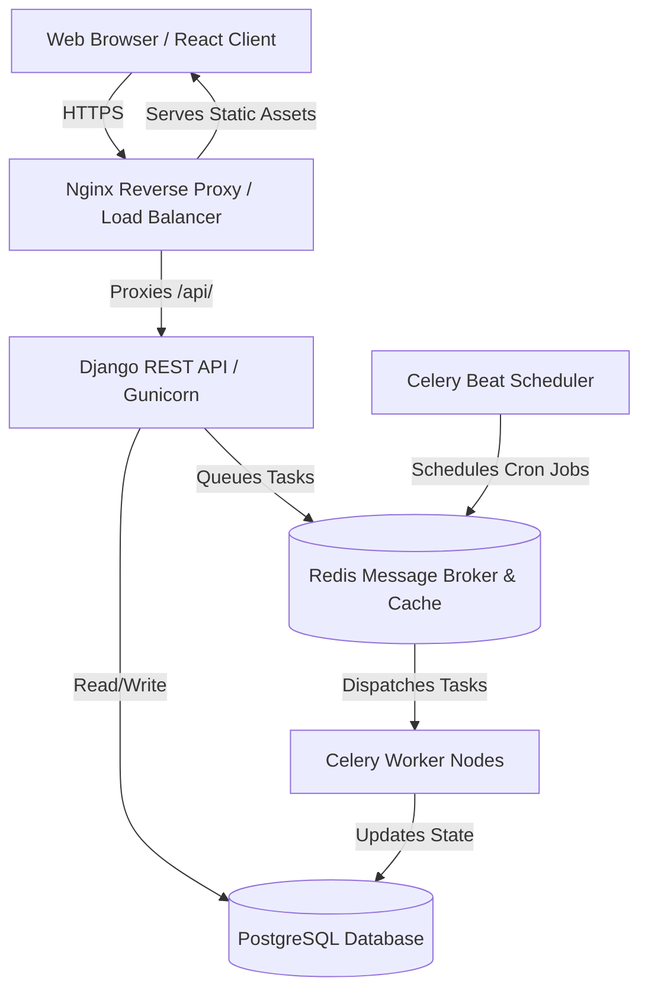
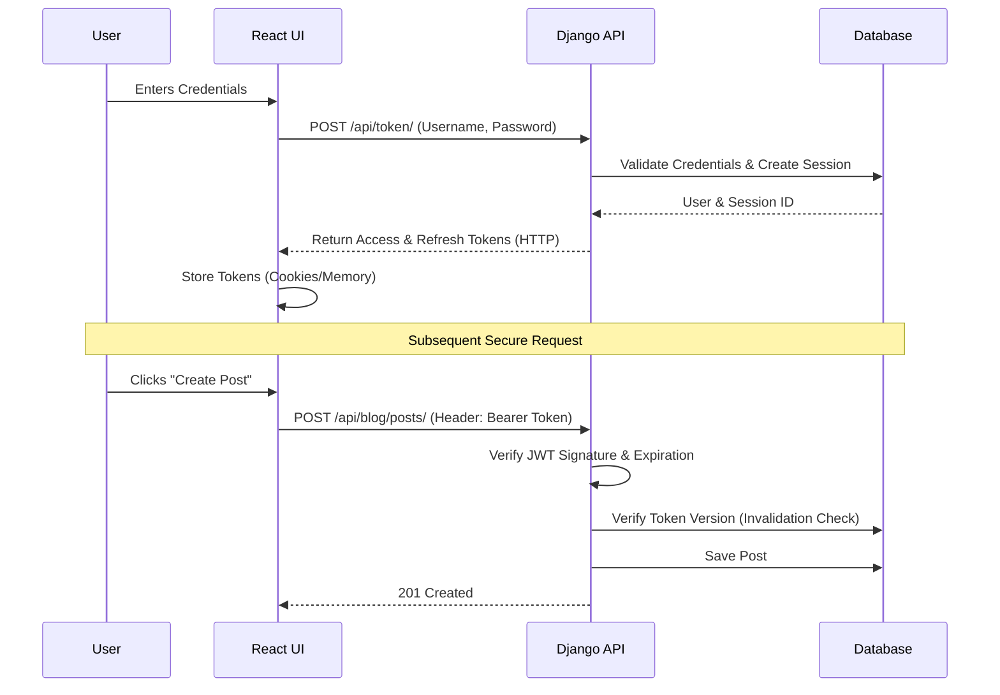

<div align="center">
  <h1>🚀 NexusFlow | Enterprise Full-Stack Web Architecture</h1>
  <p><strong>A production-ready, highly scalable blog and interaction platform built with Django REST Framework, React (Vite), and Docker.</strong></p>

  [](https://www.python.org)
  [](https://www.djangoproject.com/)
  [](https://reactjs.org/)
  [](https://www.docker.com/)
  [](LICENSE)
</div>

---

## 🎯 The Problem & Our Solution

**The Problem:** Most tutorial applications skip the hard parts of software engineering. They build a blog, but they ignore session hijacking, cache stampedes, N+1 query problems, concurrent background processing, and deployment parity. They lack the structural integrity required to run reliably in a production environment like AWS EC2.

**The Solution:** NexusFlow is designed as a *blueprint for real-world engineering*. While its domain is a "Blog Platform," its true purpose is to demonstrate robust backend engineering and modern frontend performance. 

It solves critical production constraints by implementing:
- **Strict JWT Lifecycle Management** (Versioning, forced invalidation, multi-device tracking).
- **Idempotency** for write operations (preventing double charges/posts).
- **Asynchronous Task Processing** via Celery & Redis to offload heavy workloads.
- **Containerized Parity** guaranteeing that what works locally, works flawlessly on AWS.

---

## 📊 System Architecture & Data Flow

Our architecture is strictly decoupled. The React client acts as an independent entity communicating via a RESTful JSON API with our Django core, which in turn delegates asynchronous workloads to Celery workers.



---

## 🔄 Request Lifecycle: Authentication Flow

Understanding how we securely handle authentication across the stack:



---

## ✨ Elite Features

### 🔐 Advanced Security & Auth
- **Multi-Device Session Management:** Users can view where they are logged in and remotely revoke access to specific devices (e.g., "Log out of my phone").
- **Token Versioning:** Instantaneous global logout capabilities that immediately invalidate all issued JWTs without waiting for expiration.
- **Idempotency Middleware:** Safe retry mechanisms for network failures. A network blip won't result in publishing the same post twice.

### ⚡ Performance & Scalability
- **Celery & Redis:** Background task processing for email sending, heavy computations, and scheduled maintenance. 
- **Nginx Reverse Proxy:** Serves Vite-compiled static assets efficiently while routing API requests to the WSGI/ASGI application.
- **Optimized Database Queries:** Strategic use of `select_related` and `prefetch_related` in Django to eliminate N+1 queries during feed generation.

### 🎨 Modern Frontend Experience
- **Vite-Powered React:** Lightning-fast HMR during development and optimized tree-shaking for production builds.
- **Axios Interceptors:** Centralized logic for attaching auth tokens and gracefully handling 401 Unauthorized errors (automatic token refreshing).
- **Tailwind CSS:** Responsive, utility-first design system ensuring mobile-first compatibility.

---

## 🛠 Technical Stack & Decisions

| Layer | Technology | Why We Chose It |
|-------|------------|-----------------|
| **Frontend** | React 19, Vite, Tailwind CSS | Vite offers superior build times over Webpack. Tailwind ensures consistency. |
| **Backend** | Django 5.x, DRF | Unmatched ORM capabilities and rapid REST endpoint generation. |
| **Auth** | `djangorestframework-simplejwt` | Stateless JWTs paired with database-backed token versioning for the best of both worlds. |
| **Broker/Cache**| Redis 7-alpine | In-memory speeds vital for Celery message brokering and rate-limiting. |
| **Workers** | Celery | Industry standard for decoupled, asynchronous Python task execution. |
| **Infrastructure**| Docker & Docker Compose | Eliminates "It works on my machine." Provides seamless AWS EC2 deployment. |

---

## 📂 Elite Directory Structure

```bash
├── backend/                  # Core API System
│   ├── apps/
│   │   ├── accounts/         # Identity, Auth, & Session Management
│   │   ├── blog/             # Core Domain logic (Posts)
│   │   └── interactions/     # Likes, Comments, Notifications, Idempotency
│   ├── config/               # Settings, Middleware, WSGI/ASGI, Routing
│   ├── Dockerfile            # Python/Gunicorn Container definition
│   └── requirements.txt      
├── frontend/                 # React UI System
│   ├── src/
│   │   ├── api.js            # Axios Interceptors & Network layer
│   │   ├── components/       # Reusable UI fragments (Buttons, Forms, Cards)
│   │   ├── context/          # Global State (Auth, Toast Notifications)
│   │   └── pages/            # View-level component aggregates
│   ├── Dockerfile            # Multi-stage Node + Nginx build
│   └── nginx.conf            # Reverse Proxy configuration
├── docker-compose.yml        # Local Development Stack
└── docker-compose.prod.yml   # AWS / Production Stack
```

---

## 🚀 AWS EC2 Production Deployment

We use a fully containerized approach for production, allowing you to deploy the entire stack to an AWS EC2 instance with a single command.

### 1. Server Provisioning
Spin up an Ubuntu 24.04 EC2 instance. Ensure Security Groups allow inbound traffic on **Port 80 (HTTP)**, **Port 443 (HTTPS)**, and **Port 22 (SSH)**.

### 2. Environment Configuration
Create your production environment file (`backend/.env.prod`):
```env
SECRET_KEY=your_highly_secure_random_string
DEBUG=False
ALLOWED_HOSTS=your-domain.com,51.21.201.106
REDIS_URL=redis://redis:6379/0
```
*Note: The frontend automatically routes via Nginx, so `VITE_API_URL` should remain blank or unset to allow relative `/api/` routing.*

### 3. Build & Launch
```bash
sudo docker compose -f docker-compose.prod.yml up -d --build
```
This single command spins up the Nginx Frontend, the Gunicorn Django API, the Redis message broker, and the Celery workers.

---

## ⚡ Local Development Setup

Want to contribute or test locally?

1. **Clone & Spin up the Dev Stack:**
   ```bash
   git clone <repository-url>
   cd django-login-register
   docker-compose up --build
   ```
2. **Access the Application:**
   - **Frontend:** `http://localhost:5173`
   - **Backend API:** `http://localhost:8000`
   - **Interactive API Docs:** `http://localhost:8000/api/schema/swagger-ui/`

---

## 🧪 Testing & CI/CD

We enforce strict quality control via GitHub Actions.

- **Backend Tests:** Extensive unit testing covering session lifecycle, token invalidation, and core logic.
  ```bash
  cd backend && python manage.py test
  ```
- **Continuous Integration:** Every push to `main` triggers automated linting, test suites, and Docker build verifications to ensure the main branch is always deployable.

---

<div align="center">
  <i>Engineered for stability, designed for scale.</i><br>
  <b>Built with ❤️ by Ashif Ek</b>
</div>
